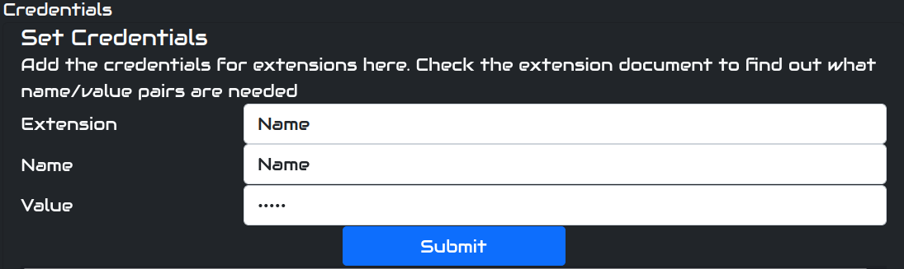

# Streamroller (current dev. stage: Prototyping v -0.000000001)
## Table of Contents

- [Streamroller (current dev. stage: Prototyping v -0.000000001)](#streamroller-current-dev-stage-prototyping-v--0000000001)
  - [Table of Contents](#table-of-contents)
  - [What is is?](#what-is-is)
  - [Why did I start it](#why-did-i-start-it)
  - [StreamRoller Direction/Development path](#streamroller-directiondevelopment-path)
  - [Main Goals](#main-goals)
- [Security](#security)
- [Installing](#installing)
  - [Step 1: Install node](#step-1-install-node)
  - [Step 2: Download Streamroller](#step-2-download-streamroller)
  - [Step 3: Intstall](#step-3-intstall)
  - [Step 4: Start StreamRoller](#step-4-start-streamroller)
  - [Step 5: Configure any extensions (password/tokens etc)](#step-5-configure-any-extensions-passwordtokens-etc)
- [Current Functionality](#current-functionality)
  - [Some of the current extensions](#some-of-the-current-extensions)
  - [Logic/Controller/Display style extensions](#logiccontrollerdisplay-style-extensions)
    - [adminpage](#adminpage)
    - [liveportal](#liveportal)
  - [Datahander extensions](#datahander-extensions)
    - [twitchchat](#twitchchat)
    - [discordchat](#discordchat)
    - [streamlabs\_api](#streamlabs_api)
    - [twitter](#twitter)
    - [obs](#obs)
  - [Feature Extensions](#feature-extensions)
    - [chatbot](#chatbot)
  - [In progress](#in-progress)
  - [TBD](#tbd)
  - [Ideas for extensions](#ideas-for-extensions)
- [Links](#links)
  - [General links](#general-links)
  - [Extension links](#extension-links)
  - [Dev links](#dev-links)

## What is is?
Contact link [Discord, (streamroller-stuff channel)](https://discord.gg/5MUzJjSK). For questions, suggestions etc.

[](https://youtu.be/tGLe5n-Yyy8)

StreamRoller is a tool designed to bring all the data needed for streaming into one system to make it easier to expand your streaming features. i.e. want to post your alerts to discord/twitter without having to code a discord and twitter bot? Just load the existing extensions for twitter and discord, then forward the alert message to them to do the work for you.

As the core extensions are expand you should be able to turn any idea you might want to do into reality with a minimum of effort by controlling what messages/data go from and to.

## Why did I start it
I found while streaming I would have so many programs open (discord, twitch, chatty, UpDeck (ipad style streamdeck),StreamLabsChatbot). Fitting them all on one screen and or switching between them became a pain.

I was also finding I wanted to do things that I can't easily do. ie posting donation alerts on twitter or discord. Giving chat some extra contorols (maybe some OBS scene items they can turn on or off etc).

## StreamRoller Direction/Development path
Currently StreamRoller should be considered in prototyping stage (yup not even Alpha yet). There will probably be lots of big changes as the design ideas change.

The end goal will reamin the same, a simply and easy system to use to get your ideas working. Want to have donations written on a whiteboard behind you by a 3D printer style aparatus, a few lines of code will do it (assuming someone has written the extension for that devide already)

## Main Goals
The main goals of StreamRoller are the following:

- Single full screen webapp with all live streaming controls on one page (OBS,chat,bots etc) for the streamer
- Easy to configure by anyone with a minimal of coding experience. (currently JS, in future plans other language API's to be added. ie python API)
- Distributed. Extensions run off sockets so they can be distributed if required. 
  - Extensions can be run on any PC as long as they have internet access to the backend. ie. A moderator app can run on the moderators PC, a weather app can run on a RaberryPI in the shed, a game data app run on the gamers PC (esports style) etc.
  - If IRL streaming the live control web page could be on a phone while the rest runs at home allowing an noSignal scene to kick in when your phone connection goes down.
  - If two PC's are available the StreamRoller system can run on a second PC with only a webbrowser needing to connect to it for cotrolling everything.
# Security

_Note: Currently the system should be considered insecure._

Security will be added later. 

At it's current stage the use case for this software to be run in a controlled environment (ie at home behind your routers firewall). 

Login/users and SSL security will be added later

# Installing
Note for streaming: Additional sofware needed. The free broadcasting software [OBS Studio](https://obsproject.com/) is required. Also an overlay for your stream is recommended to show alers etc. There is a small overlay demo version included to show how to trigger alerts using StreamRoller to provide the data.

Currently (as we are using StreamLabsAPI) you will receive alerts for both Twitch and Youtube (untested but you should also get provided with info for Mixer, facebook, Trovo and TikTok if from streamlabs)
## Step 1: Install node
Streamroller needs the [node.js](https://nodejs.org/en/download/) webserver installed to run. It is recommended to use [VSCode](https://code.visualstudio.com/download) to modify/change/add extra features. This VSCode editor provides a lot of nice features for development.
## Step 2: Download Streamroller
Grab a copy of this repo and store it somewhere 
## Step 3: Intstall
cd into the StreamRoller directory and run the following commands

These install the required dependancies needed. This may take a few minutes the first time it is run.

```
npm install
```


## Step 4: Start StreamRoller
Start the server with the following comand on both windows or linux (run in the root folder)

```
npm start
```

At this point the node webserver will start up and load any extensions currently in the extension directory. point a webrowser at http://localhost:3000 to see it running.

## Step 5: Configure any extensions (password/tokens etc)

Note: Credentials are set through the admin webpage http://localhost:3000/adminpage/

If connecting to twitch/discord/youtube etc you will need to configure your login credentials/tokens etc as required by the extensions

Most extensions require these keys/tokens to be set from the admin page of streamroller in the following format (note you may need to restart the StreamRoller service when changing them depending on the extension, most shouldn't need a restart though)

First check the extension readme file for the required credentials needed. ie for twitter you need 4 keys twitterAPIkey twitterAPISecret, 
twitterAccessToken, TwitterAccessTokenSecret

To add these enter them on the admin page (case sensitive).
1) Extension: The name of the extension this credential belongs to. ie twitchchat
2) Name: The key name, ie twitterAPIkey
3) Value: the value for the key.



# Current Functionality
At the time of writing the system has twitchchat, discord, twitter, streamlabs (for alerts etc) and obs datahandling extensions, a chatbot and demo overlay (if you want to use the system for your overlay). These extensions sit behind an API so that controller extensions like the existing Adminpage web page/Live Portal web page/and demo obs overlay files can easily send and received whatever messages they wish. 

A lot of funtionality at this point is either non existant or in progress. If you have a play with the system and produce something useful or expand an existing extension please let me know.

For development of existing functionality I'd expect people to focus on one extension rather than try and understand the whole system backend. i.e. a moderator extension that can be used by all chat extensions, such that if it needs to ban a user it will just send a message to the twitch/youtube API for that extension rather than connect to the IRC chat itself.

## Some of the current extensions
See the [Extension List](docs/EXTENSION_LIST.md) for the full list
## Logic/Controller/Display style extensions
### [adminpage](extensions/adminpage/README.md)

Provides a webpage to configure the system
### [liveportal](extensions/liveportal/README.md)

The live streaming portal is a webpage that you can use on your second monitor to show all the information/settings you need on one page.
## Datahander extensions
### [twitchchat](extensions/datahandlers/twitchchat/README.md)
- Join a twitch chat channel to send receive chat messages
### [discordchat](extensions/datahandlers/discordchat/README.md)
- Post alerts to a named discord channel
- Receive messages from a given discord channel (currently used in live page as a Mod messages window)
### [streamlabs_api](extensions/datahandlers/streamlabs_api/README.md)
- Povides alerts data from streamlabs for twitch alerts and streamlab donations
- Used in the discord chat extension to alerts them to discord
- Used in demo-overlay (I also run my overlay off StreamRoller so that uses these as well
### [twitter](extensions/datahandlers/twitter/README.md)
- Post messages to twitter (need to add a reader output)
### [obs](extensions/datahandlers/obs/README.md)
- Receive status upadates from obs (stream started, scene changed etc)
- Control obs (change scenes, mute scene)
## Feature Extensions
These are extension that use the data provided by the above extensions to do something usefull
### [chatbot](extensions/chatbot/README.md)
- Provides a chatbot using the openAI chatGPT system
- Monitors chat and occasionally pops in with messages based on the conversation
- Can be asked questions that are processed by the openAI system
## In progress
- pretty much everything currently available
## TBD
Lots :D
- Installation system to make it easier for people to install without having to do commandline stuff
- proper messaging API so that dev's have an easier time expanding/writing extensions
- more data extensions (ie youtube, specific games, home control etc)
## Ideas for extensions

The current focus in on twitch streaming (although the streamlabs api currently supports other platforms as is). Other platforms will be integrated in time (Youtube etc)

- Twitch pub/sub: to allow twitch control (setting title, category, bannign users etc)
- moderator chatbot: one bot that will work with all the chat extension to provide a single moderator bot for all chat channels (discord/twitch/youtube/facebook etc)
- NDI stream extension to allow easy integration of external video feeds
- chat auto language conversion.
- TextToSpeech for chat. So us streamers don't have to focus on chat all the time :P
- Chat audio feedback. This will play sounds based on chat. ie laugh track, applause based on the % of people posting emotes.
note: suggestions welcome for this list
# Links

## General links
- [Getting Started](docs/GETTING_STARTED.md) 
  
  How to install/start/use the system
- [Extension List](docs/EXTENSION_LIST.md)
  
  List of current extensions with links to additional documentation
## Extension links
  These can be found by following the Extension list above and clicking the extension name you are interested in.
## Dev links
- [Getting start with extensions](docs/EXTENSIONS_GETTING_STARTED.md)

  Getting started with developing extensions
- [Messages](docs/MESSAGES_DOC.md)
  
  A description of how to use the message system to send/receive data
