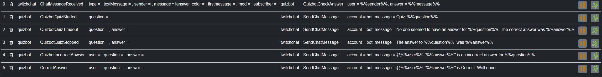

# Quizbot Extension
Contents
- [Quizbot Extension](#quizbot-extension)
  - [Outgoing channel : "QUIZBOT\_CHANNEL"](#outgoing-channel--quizbot_channel)
  - [Description](#description)
## Outgoing channel : "QUIZBOT_CHANNEL"
## Description
Quizbot will ask questions and check answers

The extension runs on triggers so these will need adding for the bot to do anything. 
An example set of triggers for twitch chat can be seen in the image below.

