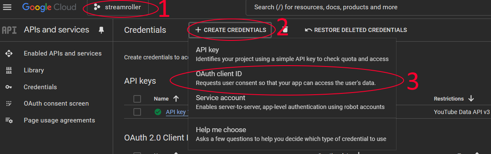
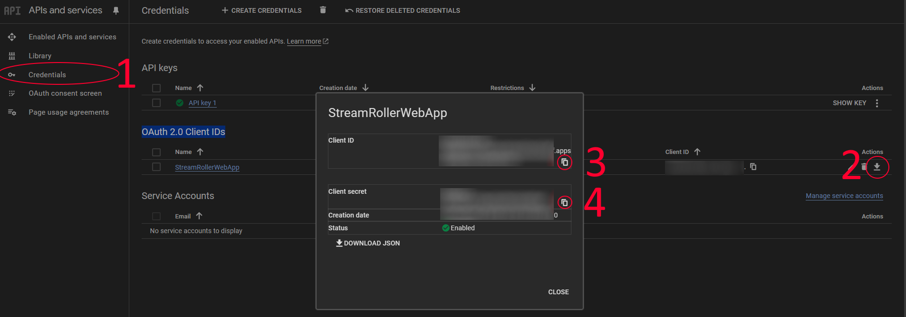

# Youtube Extension

Contents

- [Youtube Extension](#youtube-extension)
  - [Outgoing channel : "YOUTUBE"](#outgoing-channel--youtube)
  - [Description](#description)
  - [Features](#features)
  - [Settings](#settings)
    - [Settings Small (for mainpage quick links)](#settings-small-for-mainpage-quick-links)
    - [Settings Large (for main settings full page)](#settings-large-for-main-settings-full-page)
  - [Authorization](#authorization)
  - [Autopilot triggers and actions](#autopilot-triggers-and-actions)
    - [Triggers](#triggers)
      - ["trigger\_ChatMessageReceived"](#trigger_chatmessagereceived)
    - [Actions](#actions)
      - ["action\_DemoextensionDoStuff"](#action_demoextensiondostuff)
- [Google API requirements](#google-api-requirements)
    - [Step 1: Connecting StreamRoller to YouTube](#step-1-connecting-streamroller-to-youtube)
  - [Creating/Setting up Google API](#creatingsetting-up-google-api)
    - [Step 1: Google API Project setup (if you don't have one already)](#step-1-google-api-project-setup-if-you-dont-have-one-already)
      - [1. Set Up a Google Cloud Project](#1-set-up-a-google-cloud-project)
      - [2, Google Client ID and secret](#2-google-client-id-and-secret)

## Outgoing channel : "YOUTUBE"

## Description

This extension allows youtube integration.

## Features

The extension currently allows sending and receiving of chat message during a live stream (youtube messages are integrated into live portal chat window)

## Settings

### Settings Small (for mainpage quick links)

- enable/disable addon
- chat poll rate
- - This allows you to reduce the google api usage by limiting how often to check for new messages
- restore defaults
- - Resets the extension data to defaults.

### Settings Large (for main settings full page)

none

## Authorization

Authorization is preformed though the admin page link. 

Click on the extension name and enter the credentials requested, click update, then re-click the link and hit the ytoauth link at the bottom of the page to perform the authorization

- - Google CLIENT_ID
- - Google CLIENT_SECRET

See below for creating a google API account to get hold of these details [Google API requirements](#google-api-requirements)

## Autopilot triggers and actions

### Triggers

#### "trigger_ChatMessageReceived"

``` name: "YoutubeMessageReceived",
displaytitle: "YouTube Chat Message",
description: "A chat message was received. textMessage field has name and message combined",
messagetype: "trigger_ChatMessageReceived",
parameters: 
  {
  type: "trigger_ChatMessageReceived",
  platform: "Youtube",
  textMessage: "[username]: [message]",
  safemessage: "",
  color: "#FF0000",
  channel: "",
  // youtube message data
  id: "",
  message: "",
  ytmessagetype: "",
  textmessagedetails: "",
  publishedat: "",
  hasdisplaycontent: "",
  //youtube author data
  sender: "",
  senderchannelid: "",
  senderprofileimageurl: "",
  senderisverified: false,
  senderischatowner: false,
  senderischatsponsor: false,
  senderischatmoderator: false,
}
```

### Actions

#### "action_DemoextensionDoStuff"

``` name: "youtubepostlivechatmessage",
displaytitle: "Post a Message to youtube live chat",
description: "Post to youtube live chat if we are connected.",
messagetype: "action_youtubePostLiveChatMessage",
parameters: 
  { 
  message: "" 
  }
```

# Google API requirements

### Step 1: Connecting StreamRoller to YouTube
Note: If you have changed the client ID or client secret above remember to save this page before
requesting authorization!

## Creating/Setting up Google API

Note: Most paid programs would use their own Google API project but as the free Google API account only
gives you 10,000 per day it would soon stop working unless I paid for more credits.

This means I can't setup an API project for you to use as this isn't viable unless I was charging
a subscription for StreamRoller to pay for it.

Youtube Chat API is accessible only through a google API project. This page will guide you through
setting up an account and project if you don't already have one you can use.

This is a 2 step process

- Setup a Google API project to get a client id and client secret. This gives you access to the Google API's authorization process.
- Authorize StreamRoller to allow it to connect to your youtube livestream chat.

### Step 1: Google API Project setup (if you don't have one already)

In order to use the youtube API you will need to have a google cloud API account

[Create Google Account if you don't have one already](https://console.cloud.google.com)

Once setup you need to create a project for the specific API's you want to use (ie gmail, dropbox
etc), for StreamRoller you only need the <b><i>"YouTube Data API v3"</i></b> as shown below.

Follow the steps below to setup the correct project details

#### 1. Set Up a Google Cloud Project
- Go to the Google Cloud Console. 
- Create a new project (you can use any name you like here) or select an existing one.
    <a href="https://console.cloud.google.com">Google account page</a>


- Once you have your project setup and selected (as I have in the above image for the project named streamroller) click the "API and services" button in the quick access area or click <a href="https://console.cloud.google.com/apis/dashboard">Here</a>


- Set up OAuth 2.0 credentials:
- - On the click "Credentials." page
- - Create a new OAuth 2.0 Client ID set of credentials (check you are on your correct project name, 1 in the image below)



- Set the Application Type to "Desktop App" or "Web Application."
- For "Web Application," add http://localhost:3000 (or your server's port) as an authorized
            redirect URI.
- Enable the <b><i>"YouTube Data API v3"</i></b> for your project on the scopes page (second
            page during setup or editing)


- The rest of the settings can be left defaulted

#### 2, Google Client ID and secret

To get your details needed below (to allow StreamRoller to access your Google API project for youtube)
follow the following steps.

- Go to your API credentials page for the project you created <a href="https://console.cloud.google.com/apis/credentials">Credentials Page</a>.
- In the image shown below ...
- Image note 1. Click to bring up the credentials page
- Image note 2. Click on the download button for the project you created above, this will bring up the dialog box allowing you to copy/download your settings
- Image note 3. Click the 'copy' button for your Client ID and past it in the Client ID box below
- Image note 4. Click the 'copy' button for your Client Secret and past it in the Client Secret box below
- Click the update button on this page to save the data in StreamRollers encrypted file storage. You can now click the authorize link to connect streamroller to youtube

